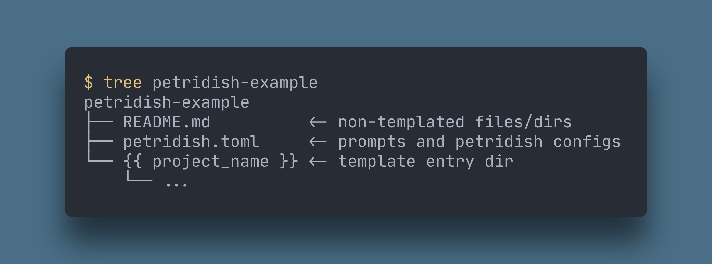

# petridish

<div align="center">
  <a href="https://github.com/petridish-dev/petridish/actions">
    
  </a>
  <a href="https://crates.io/crates/petridish">
    
  </a>
  <a href="https://github.com/zen-xu/job-book/blob/master/LICENSE">
    
  </a>
  <br>
  A command-line utility that creates project structure.
</div>


If you have heard of the [`cookiecutter`](https://github.com/cookiecutter/cookiecutter) project, `petridish` is a rust implementation of it.


## Features

| Feature                         | Description                                                                                                                                                                |
| ------------------------------- | -------------------------------------------------------------------------------------------------------------------------------------------------------------------------- |
| **Cross platform**              | Windows, Linux, MacOS                                                                                                                                                      |
| **More flexible configuration** | `petridish` use toml file to define the template variables                                                                                                                 |
| **More humanized prompt**       | support different kinds of prompt (`input`, `select`, `multi select`, `confirm`)                                                                                           |
| **Powerful template engine**    | we use [`tera`](https://github.com/Keats/tera) as our template engine, which is based on Jinja2/Django                                                                     |
| **One binary**                  | one binary run everywhere                                                                                                                                                  |
| **Manage cached templates**     | If you download a remote template, it will be cached, so later you can just use its name without download it again. You can also `list` or `remove` these cached templates |


## Usage

Like [`cookiecutter`](https://github.com/cookiecutter/cookiecutter), you should provide directory structure like this:



Let's have a look at the `petridish.toml` file:

```toml
[petridish]
project_prompt = "project name?"
project_var_name = "project_name"
short_description = "This is an awesome template"

[[prompts]]
name = "name"
prompt = "what's your name"
type = "string"

[[prompts]]
name = "age"
choices = [10, 20, 30]
default = 20
type = "number"

[[prompts]]
name = "hobby"
choices = ["running", "swimming"]
multi = true
type = "string"

[[prompts]]
name = "is_geek"
type = "bool"
default = true
```

### Petridish config
| Field             | Description                                                                                          | optional |
| ----------------- | ---------------------------------------------------------------------------------------------------- | :------: |
| project_prompt    | the prompt message for `project_var_name`, default is `project name?`                                |    ✅     |
| project_var_name  | the project var name, default is `project_name`                                                      |    ✅     |
| short_description | the short description of the template, will show in sub cmd `list`                                   |    ✅     |
| long_description  | the long description of the template, will show before first prompt (**support Markdown highlight**) |    ✅     |


### Prompt config
| Prompt kind  | Field         | Description                                            | optional |
| ------------ | ------------- | ------------------------------------------------------ | :------: |
| string input | **name**      | template var name                                      |          |
|              | **prompt**    | prompt message                                         |    ✅     |
|              | **default**   | default "", support template render                    |    ✅     |
|              | **regex**     | regex pattern, the prompt value must match the pattern |    ✅     |
|              | **type**      | must be `string`                                       |          |
| number input | **name**      | template var name                                      |          |
|              | **prompt**    | prompt message                                         |    ✅     |
|              | **default**   | default 0                                              |    ✅     |
|              | **min**       | the min value                                          |    ✅     |
|              | **max**       | the max value                                          |    ✅     |
|              | **type**      | must be `number`                                       |          |
| select       | **name**      | template var name                                      |          |
|              | **prompt**    | prompt message                                         |    ✅     |
|              | **choices**   | choice items                                           |          |
|              | **default**   | default value                                          |    ✅     |
|              | **type**      | `string` or `number`                                   |          |
| multi select | **name**      | template var name                                      |          |
|              | **prompt**    | prompt message                                         |    ✅     |
|              | **choices**   | choice items                                           |          |
|              | **default**   | default values                                         |    ✅     |
|              | **multi**     | must be `true`                                         |          |
|              | **emptyable** | whether value can be empty, default `false`            |    ✅     |
|              | **type**      | `string` or `number`                                   |          |
| confirm      | **name**      | template var name                                      |          |
|              | **prompt**    | prompt message                                         |    ✅     |
|              | **default**   | default value (default `false`)                        |    ✅     |
|              | **type**      | must be `bool`                                         |          |


## Remote git abbreviations 
`petridish` knows abbreviations for Github(`gh`) and GitLab(`gl`) projects

The format should be like `<abbreviation>[+<protocol>]:<namespace>/<project>`

`protocol` can be: https, http, ssh, (default is https)

```bash
$ petridish new gh+https:petridish-dev/example
$ petridish new example # later you can just use its name
```

If the remote http(s) project is private, `petridish` will prompt to ask `username` and `password` for authorization.

## Demo


## Template

A `Tera` template is just a text file where variables and expressions get replaced with values when it is rendered. The syntax is based on Jinja2 and Django templates.

There are 3 kinds of delimiters and those cannot be changed:

- {{ and }} for expressions
-  for statements
- {# and #} for comments

More syntax details can be found in [`tera`](https://tera.netlify.app/docs/#templates).
